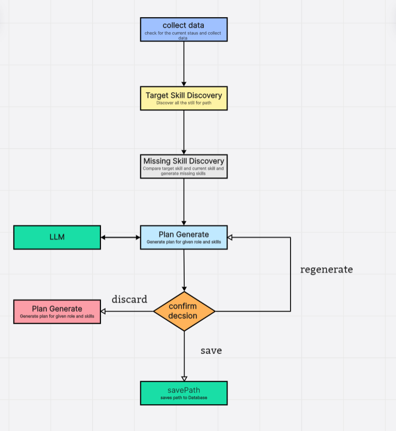
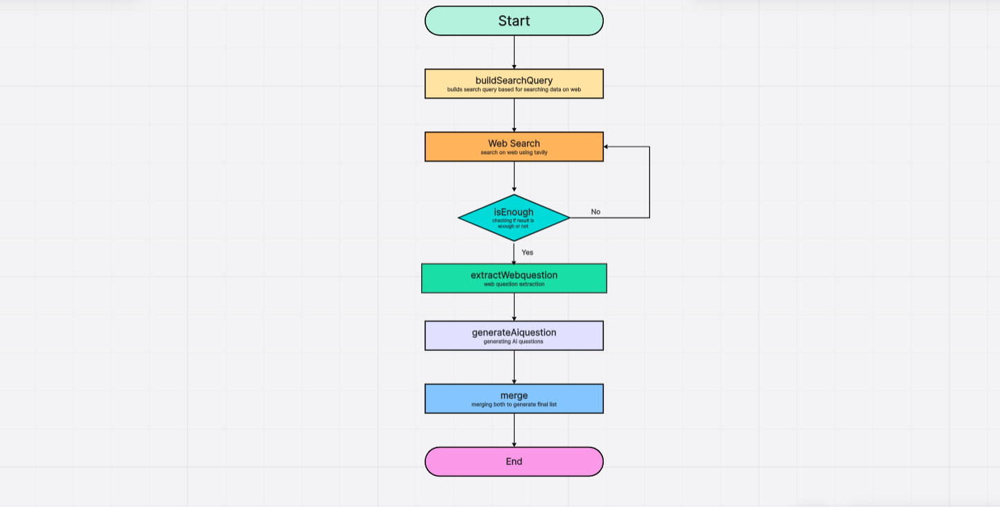

# SkillPilot – AI Career Learning Platform

SkillPilot is an AI-powered career learning platform that helps users plan their learning journey and prepare for technical interviews using a **multi-agent architecture**.

The platform analyzes a user’s **goal**, **current skills**, and **learning preferences** to:
- Generate structured learning roadmaps  
- Create interview questions for practice  
- Provide contextual answers using a knowledge-based chat system (RAG)

Instead of relying on a single LLM call, SkillPilot uses **graph-based multi-step workflows** where different AI agents handle different responsibilities.

---

## Tech Stack

### Frontend
- ReactJs
- Html, TailwindCss, Typescript

### Backend
- Node.js  
- REST API  
- TypeScript
- Jwt Tokens 

### AI / GenAI
- LangGraph  
- LangChain  
- Retrieval-Augmented Generation (RAG)  
- LLM APIs (Groq, Cohere)
- Web Search (Tavily)

### Database
- MongoDB  
- Vector Database

### Validation / Schema
- Zod

# AI Agents in SkillPilot

The platform consists of three main AI agents:

---

## 1. Learning Path Generator Agent

### Purpose
Generates a structured **day-wise learning roadmap** based on:
- user goal  
- current skills  
- experience level  
- available daily learning time  

### Workflow

# 1. AI Skill Learning Path Agent

An AI-powered learning roadmap generator agent built using a graph-based workflow architecture with **LangGraph** and **LangChain**.

The agent uses a multi-step, state-driven pipeline (instead of a single LLM call) to analyze a user’s goal, current skills, and available time, detect skill gaps, and generate a structured day-wise learning plan with human-in-the-loop options to save, regenerate, or discard the result.

## Overview

This project implements an **AI workflow agent** that performs the following steps:

1. Collect user learning data  
2. Discover target skills required for the goal  
3. Detect missing skills  
4. Generate a structured learning roadmap using an LLM  
5. Ask for user confirmation (save / regenerate / discard)

The agent uses:

- Graph-based workflow execution  
- Typed state validation using Zod  
- Thread-based memory using checkpointer  

---
## Agent Workflow

# 2 Question Generation Agent

This project implements an **AI-powered Question Generation Agent** that combines **web-extracted questions** and **AI-generated questions** to produce a high-quality final question list for a given topic.

The agent follows a structured workflow including query building, web search, validation, extraction, AI generation, and merging.

---

## Workflow Overview

The agent pipeline works as follows:

1. The workflow begins when a topic or input context is provided.
2. The agent constructs an optimized search query from the input topic to retrieve relevant data from the web.
3. The agent performs a web search using a search API (e.g. Tavily).
4. The agent checks whether the retrieved results are sufficient. If not sufficient, the agent refines the query and repeats the web search step.
5. The agent extracts relevant or frequently asked questions from the collected web content.
6. The agent generates additional questions using an LLM to improve coverage and diversity.
7. Web-extracted and AI-generated questions are merged, and a final structured list is prepared.
8. The final question set is returned as the output.

---
## Architecture Flow

